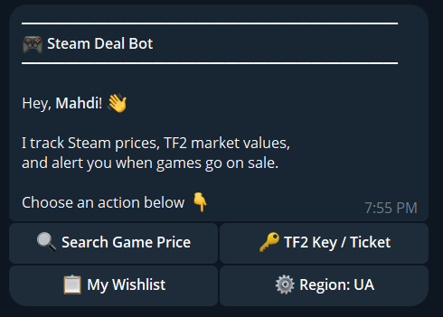
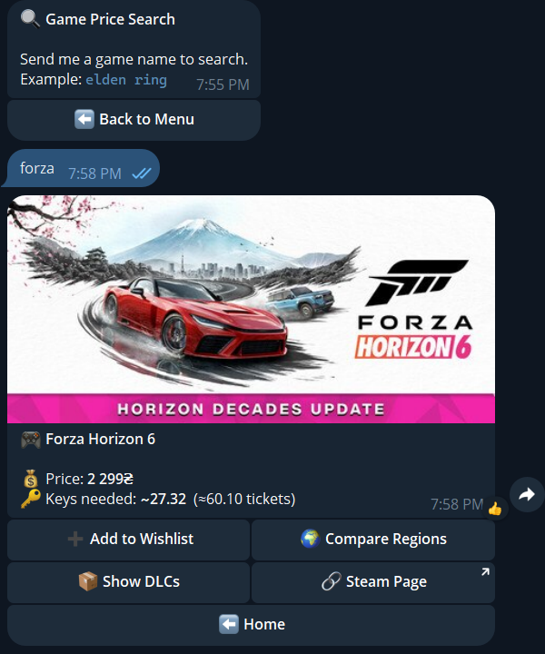
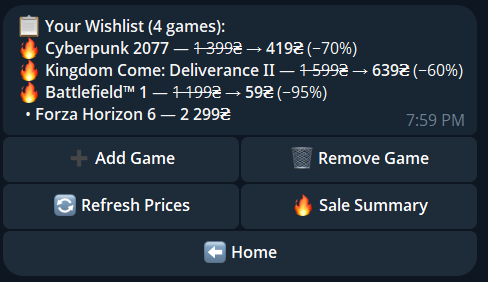
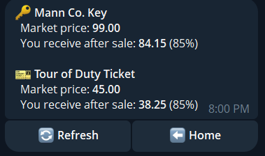
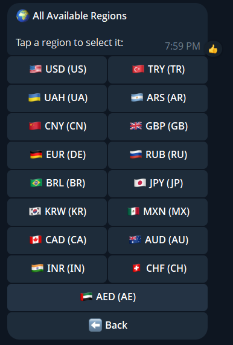
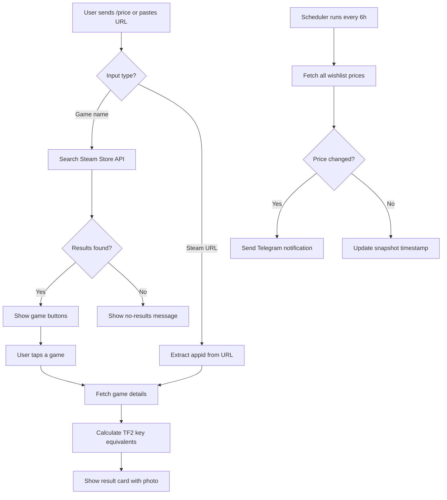

<div align="center">

# 🎮 Steam Deal Bot

### Your all-in-one Telegram bot for Steam game prices, TF2 market tracking, and smart wishlist alerts.

[](https://python.org)
[](https://core.telegram.org/bots/api)
[](LICENSE)
[](https://www.docker.com)
[](https://docs.astral.sh/ruff/)

<br>

**Search any Steam game** → **See prices in your region** → **Compare across countries** → **Track wishlisted games** → **Get notified on price drops**

<br>

</div>

---

## 📸 Screenshots

<div align="center">

| **🏠 Home Menu** | **🔍 Search Results** | **📋 Wishlist** |
|:---:|:---:|:---:|
|  |  |  |

| **🔑 TF2 Prices** | **⚙️ Region Picker** |
|:---:|:---:|
|  |  |

</div>

---

## ✨ Features

<table>
<tr>
<td width="50%">

### 🔍 Price Search
Search any Steam game and see:
- Current price in your local currency
- Discount percentage & original price
- Number of TF2 keys/tickets needed to buy it
- Game cover art preview
- **Paste Steam URLs directly** for instant results
- **Game info**: Developer, genres, release date, Metacritic score, platforms
- **User reviews** with rating, percentage, and review counts
- **Last update date** for games

</td>
<td width="50%">

### 🌍 Region Comparison
Compare prices across **17+ regions**:
- 🇺🇸 US · 🇹🇷 TR · 🇺🇦 UA · 🇦🇷 AR · 🇨🇳 CN
- 🇬🇧 GB · 🇩🇪 DE · 🇯🇵 JP · 🇰🇷 KR · and more
- Find the cheapest region for any game

</td>
</tr>
<tr>
<td>

### 📋 Smart Wishlist
Track games you want:
- Add via search, command, or **Steam URL**
- 🔄 **Refresh prices** anytime
- 🔥 Sale summary (only discounted games)
- Automatic price change notifications
- Clean, organized list with sale highlights
- **Wishlist stats**: Total value, games on sale, potential savings

</td>
<td>

### 🔑 TF2 Market
Live Mann Co. key & ticket prices:
- Market price + net proceeds (after 15% Steam fee)
- Convert between keys/tickets and currency
- TTL-cached for fast responses

</td>
</tr>
<tr>
<td>

### ⚡ Inline Mode
Search from **any chat**:
- Type `@botname elden ring` in any conversation
- See price cards as inline results
- Tap to send a formatted price card

</td>
<td>

### 🔗 Steam URL Support
Paste a Steam store URL anywhere:
- `/price https://store.steampowered.com/app/1174180/`
- `/wishlist add <url>`
- Or just paste the URL directly in chat
- Instantly shows the game's price card

</td>
</tr>
<tr>
<td colspan="2">

### 🐳 Docker Ready
Production-grade deployment:
- Multi-stage Docker build
- Health check endpoint
- Persistent data via volumes
- Configurable port

</td>
</tr>
</table>

---

## 🚀 Quick Start

### Option 1: Docker (Recommended)

```bash
# Clone the repository
git clone https://github.com/Mahdirnj/Steam-Bot.git
cd Steam-Bot

# Create your .env file
cp .env.example .env
# Edit .env and add your BOT_TOKEN from @BotFather

# Build and run
docker compose up -d --build

# View logs
docker compose logs -f bot
```

### Option 2: Manual Setup

```bash
# Clone the repository
git clone https://github.com/Mahdirnj/Steam-Bot.git
cd Steam-Bot

# Create virtual environment
python -m venv venv
source venv/bin/activate  # Linux/Mac
# venv\Scripts\activate   # Windows

# Install dependencies
pip install -r requirements.txt

# Create your .env file
cp .env.example .env
# Edit .env and add your BOT_TOKEN from @BotFather

# Run the bot
python main.py
```

---

## 🤖 Bot Commands

| Command | Description |
|---------|-------------|
| `/start` | Welcome message with quick-action menu |
| `/help` | Show all available commands |
| `/price <game\|url>` | Search for a game's price (accepts names or Steam URLs) |
| `/tf2` | Show live Mann Co. Key & Ticket prices |
| `/convert <amount> [keys\|tickets]` | Convert between keys/tickets and currency |
| `/wishlist` | View your wishlist with current prices |
| `/wishlist add <game\|url>` | Add a game to your wishlist (accepts names or Steam URLs) |
| `/wishlist remove` | Interactive game removal picker |
| `/wishlist summary` | Show only games currently on sale |
| `/region` | Change your default region/currency |

### 💡 Tips
- **Paste a Steam URL** anywhere in chat to instantly see the game's price card
- Use inline mode (`@botname <game>`) to search from any conversation

---

## ⚙️ Configuration

### Environment Variables

| Variable | Required | Default | Description |
|----------|----------|---------|-------------|
| `BOT_TOKEN` | ✅ | — | Telegram bot token from [@BotFather](https://t.me/BotFather) |
| `DB_PATH` | ❌ | `./bot.db` | SQLite database file path |
| `LOG_LEVEL` | ❌ | `INFO` | Logging level (`DEBUG`, `INFO`, `WARNING`, `ERROR`) |
| `WEB_PORT` | ❌ | `5000` | Health check server port (Docker) |

### Enabling Inline Mode

1. Open [@BotFather](https://t.me/BotFather) in Telegram
2. Send `/setinline` and select your bot
3. Set the placeholder text: `Search for a Steam game…`
4. Done! Users can now type `@yourbot <game>` in any chat

---

## 📁 Project Structure

```
Steam-Bot/
├── main.py                 # Entry point — builds app, registers handlers, starts polling
├── config.py               # Pydantic settings loaded from .env
├── health.py               # Async health check server (/health endpoint)
├── region_map.py           # ISO country code → Steam currency code mapping
│
├── bot/
│   ├── keyboards.py        # All InlineKeyboardMarkup builders
│   ├── messages.py         # Message templates and text constants
│   ├── utils.py            # Shared utilities (Steam URL parsing)
│   └── handlers/
│       ├── start.py        # /start, /help, main menu callbacks
│       ├── price.py        # /price — search, result card, compare, DLCs, URL support
│       ├── wishlist.py     # /wishlist — list, add, remove, refresh, summary, URL support
│       ├── tf2.py          # /tf2, /convert — key/ticket prices
│       ├── settings.py     # /region — region picker
│       └── inline.py       # Inline mode — @botname search from any chat
│
├── services/
│   ├── steam.py            # Steam Store API (storesearch, appdetails)
│   ├── tf2_market.py       # TF2 Community Market (prices, commission math)
│   └── notifier.py         # Price change notifications
│
├── db/
│   ├── database.py         # SQLite connection helper (aiosqlite)
│   ├── crud.py             # Database operations (users, wishlist, snapshots)
│   └── schema.sql          # Database schema
│
├── scheduler/
│   └── jobs.py             # Background job — checks wishlist prices every 6h
│
├── scripts/                # Integration & unit test scripts
│   ├── test_steam.py
│   ├── test_tf2_market.py
│   ├── test_region_map.py
│   └── test_db.py
│
├── deploy/
│   └── bot.service         # systemd service unit (non-Docker deploy)
│
├── images/                 # Screenshot images for README
│
├── Dockerfile              # Multi-stage Docker build
├── docker-compose.yml      # Docker Compose configuration
├── .dockerignore           # Docker build exclusions
├── .env.example            # Environment variable template
├── requirements.txt        # Python dependencies
└── .gitignore              # Git exclusions
```

---

## 🛠️ Tech Stack

| Component | Technology |
|-----------|------------|
| **Language** | Python 3.11+ |
| **Bot Framework** | [python-telegram-bot](https://github.com/python-telegram-bot/python-telegram-bot) v21 |
| **HTTP Client** | [httpx](https://www.python-httpx.org/) (async) |
| **Database** | SQLite via [aiosqlite](https://github.com/omnilib/aiosqlite) |
| **Config** | [pydantic-settings](https://docs.pydantic.dev/latest/concepts/pydantic_settings/) |
| **Caching** | [cachetools](https://github.com/tkem/cachetools) (TTL cache) |
| **Logging** | [loguru](https://github.com/Delgan/loguru) |
| **Health Check** | [aiohttp](https://docs.aiohttp.org/) |
| **Deployment** | Docker / systemd |

---

## 📊 How It Works



---

## 🔗 Steam URL Support

The bot supports pasting Steam store URLs directly for instant game lookups:

### Supported URL Formats
```
https://store.steampowered.com/app/1174180/Red_Dead_Redemption_2/
https://store.steampowered.com/app/1174180/
http://store.steampowered.com/app/1174180
store.steampowered.com/app/1174180
```

### Usage Examples
```
# Search by URL
/price https://store.steampowered.com/app/1174180/

# Add to wishlist by URL
/wishlist add https://store.steampowered.com/app/1174180/

# Or just paste the URL directly in chat!
```

---

## 🎮 Game Info Card

When you search for a game, the result card now shows additional information:

- **Developer** — Who made the game
- **Genres** — Action, RPG, Adventure, etc.
- **Release Date** — When it launched (or "Coming Soon" for unreleased games)
- **User Reviews** — Review rating with percentage (e.g., "Very Positive" at 87%)
- **Metacritic Score** — If available, shows the critic score out of 100
- **Platforms** — Windows, Mac, Linux support

> **Note:** The last update date is shown when available from the Steam API. Not all games have this information available.

### Review Ratings Explained

Steam uses these rating categories:
- **Overwhelmingly Positive** — 95%+ positive with 500+ reviews
- **Very Positive** — 80%+ positive with 50+ reviews
- **Mostly Positive** — 70-79% positive
- **Mixed** — 40-69% positive
- **Mostly Negative** — 20-39% positive
- **Very Negative** — 20%+ positive with 50+ reviews
- **Overwhelmingly Negative** — 20%+ positive with 500+ reviews

### Example Game Info Card

```
━━━━━━━━━━━━━━━━━━━━━━━━━━
🎮 Red Dead Redemption 2

💰 Price: $59.99
🔑 Keys needed: ~23.52 (≈47.05 tickets)

━━━━━━━━━━━━━━━━━━━━━━━━━━
🏢 Rockstar Games
🎭 Action · Adventure · Western
📅 Release date: Oct 26, 2018
⭐ Metacritic: 97/100
👍 User Reviews: Very Positive (87% positive)
💻 Windows
```

---

## 📊 Wishlist Stats

Your wishlist now shows helpful statistics at the top:

- **Total Value** — Sum of all wishlisted games' current prices
- **Games on Sale** — How many games are currently discounted
- **Potential Savings** — How much you'd save if you bought all discounted games now

---

## 🔧 Development

### Running Tests

```bash
# Run from the scripts/ directory
cd scripts/
python test_region_map.py    # Region mapping tests
python test_db.py            # Database CRUD tests
python test_steam.py         # Steam API integration tests (requires internet)
python test_tf2_market.py    # TF2 market tests (requires internet)
```

### Code Style

This project uses [Ruff](https://docs.astral.sh/ruff/) for linting and formatting.

```bash
pip install ruff
ruff check .
ruff format .
```

---

## 🚢 Deployment

### Docker

```bash
# Build and start
docker compose up -d --build

# View logs
docker compose logs -f bot

# Stop
docker compose down

# Custom port
WEB_PORT=8080 docker compose up -d --build
```

### systemd (Non-Docker)

```bash
# Copy the service file
sudo cp deploy/bot.service /etc/systemd/system/

# Edit with your paths
sudo nano /etc/systemd/system/bot.service

# Enable and start
sudo systemctl daemon-reload
sudo systemctl enable bot
sudo systemctl start bot

# View logs
sudo journalctl -u bot -f
```

---

## 🤝 Contributing

Contributions are welcome! Here's how:

1. **Fork** the repository
2. **Create** a feature branch (`git checkout -b feature/amazing-feature`)
3. **Commit** your changes (`git commit -m 'Add amazing feature'`)
4. **Push** to the branch (`git push origin feature/amazing-feature`)
5. **Open** a Pull Request

---

## 📝 License

This project is licensed under the MIT License — see the [LICENSE](LICENSE) file for details.

---

## 🙏 Acknowledgments

- [python-telegram-bot](https://github.com/python-telegram-bot/python-telegram-bot) — Amazing Telegram Bot framework
- [Steam Web API](https://developer.valvesoftware.com/wiki/Steam_Web_API) — Game data and pricing
- [Steam Community Market](https://steamcommunity.com/market/) — TF2 item prices

---

<div align="center">

**Made with ❤️ for the gaming community**

[⬆ Back to Top](#-steam-deal-bot)

</div>
